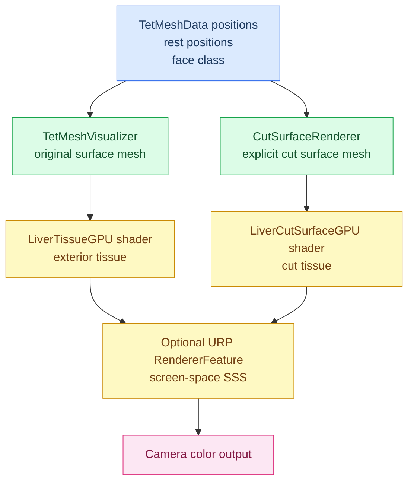
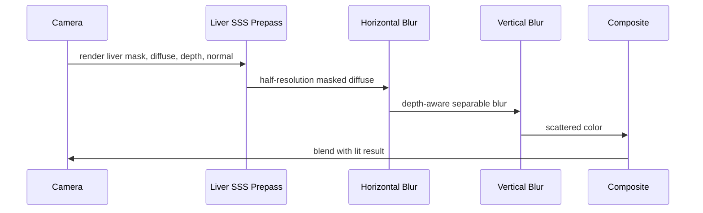

# Realistic GPU Liver Rendering Improvement Plan

Date: 2026-05-17

This plan targets the rendering layer of the surgical tissue simulation. It assumes the current physics, cutting, collision, and grasping systems remain in place, and focuses on making the visible liver surface and cut tissue look materially plausible in real time on the GPU.

## Current Diagnosis

The current rendering result is not realistic mainly because the shader and material responsibilities are mixed with cut-surface classification. The liver mesh is being shaded as if back-facing fragments are interior tissue, while the cutting plan already says the shader must not decide whether a face is cut tissue. The main mesh should render only exterior tissue; cut tissue must come from explicit cut-surface geometry.

The main visual defects are:

1. Over-bright albedo composition in `PhotorealisticLiver.shader`.
   - The current albedo path multiplies `texColor * baseAlbedo * 1.8`, which can push the surface into pale cream/white.
   - This is visible in the screenshot as a washed-out liver body rather than dark red-brown wet tissue.

2. Incorrect interior classification by `VFACE`.
   - The current shader treats back-facing fragments as `_InteriorColor`.
   - This conflicts with `docs/continuous_cutting_v7_plan.md`, which requires cut-surface rendering to come from explicit cut faces, not shader-side inference.

3. Incomplete texture input set.
   - The project currently has `Assets/Texture/liver2.png`.
   - There is no dedicated normal map, roughness/smoothness map, thickness map, ambient occlusion map, or cut-surface material map.
   - Without these channels, the shader can only fake realism procedurally.

4. Cut surfaces are too flat.
   - `CutSurfaceRenderer` creates an Unlit material by default.
   - Real cut tissue should respond to scene lighting, shadows, wet specular highlights, and subsurface/transmission cues.

5. Triplanar controls are partially disconnected.
   - The custom shader samples triplanar albedo/normal from rest-space positions, which is the right direction for deforming tissue.
   - The current implementation does not consistently apply `_MainTex_ST` and `_NormalMap_ST`, so material tiling/offset controls are unreliable.

6. Mesh update path is CPU-driven.
   - `TetMeshVisualizer.Refresh()` uploads vertex positions into a Unity `Mesh`.
   - This is acceptable for the first rendering upgrade, but the highest-performance version should render from GPU buffers directly.

## Reference Direction

SofaUnity's useful rendering pattern is not a special tissue shader; it is a clean mesh-to-material pipeline:

1. `SofaVisualModel` creates and updates a Unity `Mesh`.
2. It updates topology, UVs, normals, and bounds when SOFA changes the mesh.
3. It uses Unity materials and render-pipeline defaults if no custom material exists.
4. Example SofaUnity organ materials use URP/PBR-style inputs such as base map, normal map, parallax map, smoothness, metallic, and double-sided rendering.

For this project, the correct adaptation is:

- keep rest-space triplanar mapping because the tet mesh deforms and does not have stable authored UVs;
- use SofaUnity-style disciplined material assignment and texture channel usage;
- add real-time tissue-specific GPU shading on top of URP instead of relying only on generic URP Lit.

Useful external algorithm references:

- Unity URP Lit shader: physically based lighting, smoothness, normal maps, height maps, render face control.
- Unity normal-map import pipeline: normal maps must be imported as normal data to produce correct real-time lighting.
- GPU Gems real-time subsurface scattering: real-time shading can approximate translucent tissue even without full path tracing.
- Jimenez 2015 separable subsurface scattering: screen-space SSS can be implemented as two separable 1D blur passes, practical for real-time rendering.
- Ben Golus-style triplanar normal mapping: correct normal blending is needed when using triplanar projection instead of UVs.

## Target Visual Result

The target is not a generic red object. The target is a wet deformable liver with:

1. dark red-brown base color, not pale pink or cream;
2. mottled biological color variation at multiple scales;
3. fine surface bump detail from normal or procedural normal data;
4. non-metallic wet specular highlights with controlled roughness variation;
5. soft reddish subsurface response at silhouettes and backlit regions;
6. cut faces that are darker, wetter, and more fibrous than the exterior surface;
7. stable texture projection under XPBD deformation and cutting;
8. real-time GPU execution in URP 12.1.15.

## Rendering Architecture

The core rule is strict:

- `OriginalSurface` receives the exterior liver shader.
- `CutSurface` receives the cut tissue shader.
- No shader uses `VFACE` to decide that a face is cut tissue.
- Backface handling is used only for double-sided normal orientation and visibility.

## Algorithm Plan

### P0: Correctness and Immediate Visual Fixes

Goal: remove the current major artifacts without changing the whole renderer.

Implementation tasks:

1. Patch `PhotorealisticLiver.shader`.
   - Remove the `* 1.8` albedo boost.
   - Replace color composition with controlled tissue tinting:
     - base color supplies tissue hue;
     - albedo texture supplies mottling/detail;
     - final albedo stays in a dark red-brown biological range.
   - Apply `_MainTex_ST` in triplanar albedo sampling.
   - Apply `_NormalMap_ST` in triplanar normal sampling.
   - Stop using `VFACE` to assign `_InteriorColor` on the main mesh.
   - Keep `VFACE` only to flip normal orientation for double-sided lighting.
   - Reduce default SSS and Fresnel so they add softness instead of bleaching the model.

2. Patch `SoftBody.SetupTwoSidedMaterial()`.
   - Set both custom shader property names and URP-compatible aliases:
     - `_MainTex` and `_BaseMap`;
     - `_NormalMap` and `_BumpMap`;
     - `_Color` and `_BaseColor`;
     - `_Roughness` and `_Smoothness`.
   - Use biologically plausible defaults:
     - base color: dark liver red/brown;
     - metallic: `0`;
     - roughness: moderate, with wet specular controlled separately;
     - texture strength: lower than current if the texture is bright.
   - Load missing normal map gracefully.

3. Patch `CutSurfaceRenderer`.
   - Replace default Unlit cut material with a Lit or custom wet cut-tissue material.
   - Enable two-sided rendering.
   - Use dark red interior color.
   - Enable specular/smoothness and lighting response.
   - Keep cut material separate from exterior material.

Expected result:

- The liver stops rendering as cream/white.
- Exterior and cut tissue are visually separated.
- Cut faces react to lighting.
- The change stays compatible with the current v7 cut-surface rule.

### P1: Dedicated GPU Tissue Shaders

Goal: replace the current single custom shader with two specialized tissue shaders.

New shader files:

1. `Assets/SurgicalSim/Shaders/LiverTissueGPU.shader`
   - exterior liver tissue;
   - opaque, double-sided, URP Forward pass;
   - triplanar albedo;
   - triplanar normal;
   - Cook-Torrance/GGX wet specular;
   - wrapped diffuse;
   - cheap direct SSS/backlight approximation;
   - Fresnel wet rim;
   - procedural micro-mottling fallback.

2. `Assets/SurgicalSim/Shaders/LiverCutSurfaceGPU.shader`
   - explicit cut tissue;
   - darker albedo;
   - stronger wetness;
   - procedural fiber/noise pattern;
   - lower smooth normal blending across cut folds;
   - optional blood-darkening near rim or high-curvature regions.

3. Optional shared include:
   - `Assets/SurgicalSim/Shaders/LiverTissueCommon.hlsl`
   - shared GGX, triplanar, noise, and SSS helpers.

Shader channels:

| Channel | Exterior Tissue | Cut Tissue |
| --- | --- | --- |
| Albedo | `liver2.png` or upgraded `liver_albedo` | generated/dedicated cut albedo |
| Normal | normal map or procedural bump | stronger procedural fiber normal |
| Roughness | texture/procedural variation | lower roughness for wetter look |
| Thickness | estimated or map-driven | local cut thickness/darkening |
| AO | optional map/procedural crevice | optional edge/rim darkening |

Expected result:

- More believable wet tissue without waiting for screen-space SSS.
- Stable detail during deformation because sampling uses rest-space triplanar coordinates.
- Main and cut surfaces can be tuned independently.

### P2: Texture Asset Upgrade and Generation

Goal: remove the current dependency on one albedo-only texture.

Preferred assets:

1. `Assets/Texture/liver_albedo.png`
2. `Assets/Texture/liver_normal.png`
3. `Assets/Texture/liver_roughness.png`
4. `Assets/Texture/liver_ao.png`
5. `Assets/Texture/liver_thickness.png`
6. `Assets/Texture/liver_cut_albedo.png`
7. `Assets/Texture/liver_cut_normal.png`

If real tissue maps are not available, add an Editor generator:

- input: `liver2.png`;
- output:
  - approximate normal from luminance gradients;
  - roughness from inverted high-frequency contrast;
  - AO from low-frequency luminance;
  - cut-surface procedural textures from layered noise and red-brown color ramps.

This generator should be treated as a bootstrap, not the final realism source. A real scanned/painted texture set will still look better.

Expected result:

- Better surface detail and lighting response.
- Fewer shader hacks needed to fake tissue structure.

### P3: Screen-Space Subsurface Scattering

Goal: add high-quality real-time translucency while keeping URP.

New render feature:

- `Assets/SurgicalSim/Rendering/LiverSSSRendererFeature.cs`
- `Assets/SurgicalSim/Shaders/LiverSSSPrepass.shader`
- `Assets/SurgicalSim/Shaders/LiverSSSBlur.shader`
- `Assets/SurgicalSim/Shaders/LiverSSSComposite.shader`

Pipeline:

Rules:

- Use half-resolution targets first for performance.
- Blur only pixels marked as liver/cut tissue.
- Depth and normal thresholds stop bleeding across silhouettes and unrelated objects.
- Kernel radius is driven by material thickness and user quality setting.
- Exterior and cut tissue can use different scattering colors/radii.

Expected result:

- Softer silhouettes.
- More realistic light diffusion through thin/deformed tissue regions.
- Less plastic-looking specular-only surface.

### P4: GPU-Driven Mesh Rendering Optimization

Goal: reduce CPU mesh upload cost after visual quality is fixed.

Current path:

- CPU reads positions from solver;
- `TetMeshVisualizer.Refresh()` updates Unity `Mesh` vertices;
- shader receives interpolated mesh attributes.

Future path:

- surface index buffer remains static or locally updated;
- shader reads positions from `StructuredBuffer<float3>` using particle IDs;
- rest positions and face class data live in GPU buffers;
- draw uses procedural or indirect rendering where practical.

This stage is not required for the first visual upgrade. It should be done only after P0-P3 prove the material model.

## Material Defaults

Initial exterior parameters:

| Parameter | Value |
| --- | --- |
| Base color | `(0.42, 0.045, 0.030, 1)` |
| Texture strength | `0.45-0.60` |
| Triplanar scale | `5-9`, tuned by model size |
| Triplanar blend | `4-8` |
| Metallic | `0` |
| Roughness | `0.38-0.55` |
| Wet specular strength | `0.35-0.70` |
| SSS color | dark orange-red |
| SSS strength | `0.20-0.45` |
| Fresnel strength | `0.10-0.30` |

Initial cut-surface parameters:

| Parameter | Value |
| --- | --- |
| Base color | `(0.24, 0.018, 0.014, 1)` to `(0.42, 0.04, 0.03, 1)` |
| Roughness | `0.25-0.45` |
| Wet specular strength | `0.55-0.95` |
| Fiber intensity | `0.20-0.45` |
| SSS strength | `0.15-0.35` |
| Rim darkening | `0.10-0.25` |

## Integration Points

Files likely to change in P0-P1:

- `Assets/SurgicalSim/Shaders/PhotorealisticLiver.shader`
- `Assets/SurgicalSim/Shaders/LiverTissueGPU.shader`
- `Assets/SurgicalSim/Shaders/LiverCutSurfaceGPU.shader`
- `Assets/SurgicalSim/SoftBody.cs`
- `Assets/SurgicalSim/Cutting/CutSurfaceRenderer.cs`
- `Assets/SurgicalSim/Core/TetMeshVisualizer.cs`

Files likely to change in P3:

- `Assets/SurgicalSim/Rendering/LiverSSSRendererFeature.cs`
- `Assets/SurgicalSim/Shaders/LiverSSSPrepass.shader`
- `Assets/SurgicalSim/Shaders/LiverSSSBlur.shader`
- `Assets/SurgicalSim/Shaders/LiverSSSComposite.shader`
- `Assets/Settings/UniversalRenderer.asset`

The plan should avoid changing:

- XPBD solver behavior;
- collision and grasping behavior;
- cutting topology rules;
- face classification semantics from the v7/v8 cutting plan.

## Verification Plan

Static verification:

1. Confirm shaders compile in Unity.
2. Confirm no shader path assigns cut/interior color based on `VFACE` for the main exterior mesh.
3. Confirm material properties are set with `HasProperty` checks where needed.
4. Confirm cut-surface renderer uses a lit material.
5. Confirm normal map import settings use Unity's Normal Map texture type.

Runtime visual checks:

1. Exterior liver under default light:
   - not white or cream;
   - visible mottled red-brown texture;
   - stable detail while deforming.

2. Cut surface after straight cut:
   - darker than exterior;
   - lit by scene lights;
   - no flat unlit pink patch;
   - no shader-inferred fake interior on unrelated backfaces.

3. Curved/S-shaped cut:
   - continuous cut surface remains visually coherent;
   - no repeated stale patch ribbons;
   - cut and exterior materials stay separated.

4. Performance:
   - P0/P1 should remain close to current FPS except for added texture samples.
   - P3 SSS should be optional and quality-scaled.
   - Half-resolution SSS should be the default.

Visual acceptance target:

- The model should read as wet liver tissue at first glance.
- The cut face should read as exposed inner tissue, not a debug cap.
- The surface should still be real-time during XPBD deformation and cutting.

## Feasibility Review

### What Is Highly Feasible

P0 is highly feasible. It is a direct correction of current shader/material logic and matches the existing code shape. The project already has:

- URP 12.1.15;
- a custom liver shader;
- rest-position UV1 data from `TetMeshVisualizer`;
- separate cut-surface rendering infrastructure;
- explicit cut-surface requirements in the v7 plan.

P1 is also feasible. Custom HLSL shaders with triplanar mapping, GGX specular, wrapped diffuse, and procedural noise are standard real-time GPU work. This does not require changing physics.

### What Is Feasible With Asset Caveats

P2 is feasible, but final quality depends heavily on texture quality. A generated normal/roughness map from `liver2.png` can improve detail, but it cannot match a real scanned material set.

For the best final rendering, the project should eventually include real or carefully authored:

- albedo;
- normal;
- roughness/smoothness;
- thickness/translucency;
- cut-surface maps.

### What Is Feasible But Higher Risk

P3 is feasible in URP, but it is a rendering-pipeline feature, not just a material edit. It requires:

- a liver mask/prepass;
- temporary render textures;
- renderer feature wiring in the URP renderer asset;
- visual tuning to avoid blur bleeding across silhouettes.

The quality payoff is high, but the implementation risk is higher than P0/P1.

P4 is feasible but should not be part of the first visual delivery. GPU-driven mesh rendering would improve performance architecture, but it touches solver/render data ownership and may complicate cutting/debugging.

## Can This Plan Produce A Very Good Rendering Result?

Yes, with one important condition: P0 and P1 can produce a substantially better real-time result, but the best result requires better material textures.

Expected outcome by phase:

| Phase | Visual improvement | Realism ceiling |
| --- | --- | --- |
| P0 | fixes obvious wrong colors and flat cut material | moderate |
| P1 | convincing wet tissue shader and cut shader | good |
| P2 | real texture channels and better micro-detail | very good |
| P3 | soft tissue translucency and more cinematic realism | very good to excellent |
| P4 | performance/architecture improvement | no direct visual gain |

The plan is coherent because it separates three concerns that are currently entangled:

1. geometry classification belongs to cutting/render mesh code;
2. material appearance belongs to shaders/material setup;
3. soft tissue translucency belongs to material shader first, then optional screen-space SSS.

The plan should produce a much better rendering result than the current screenshot because it directly addresses the visible causes of failure: over-bright albedo, incorrect backface interior logic, missing lit cut material, weak texture channel setup, and insufficient tissue-specific shading.

## Decision Recommendation

Implement in this order:

1. P0 first, because it fixes correctness and removes the current artifacts.
2. P1 next, because it creates the real tissue material model.
3. P2 in parallel or immediately after P1, because texture channels determine the realism ceiling.
4. P3 after P1/P2 screenshots are acceptable, because screen-space SSS is powerful but more invasive.
5. P4 only after visual quality is stable and performance profiling proves CPU mesh upload is the bottleneck.

Do not start with P3 or P4. They are more complex and will not fix the current washed-out material problem by themselves.

## Source Links

- SofaUnity `SofaVisualModel.cs`: https://github.com/InfinyTech3D/SofaUnity/blob/f4a4ec73767c0afc41f317fba0ee06116edff64f/Core/Scripts/Core/Components/SofaVisualModel.cs
- SofaUnity liver material: https://github.com/InfinyTech3D/SofaUnity/blob/f4a4ec73767c0afc41f317fba0ee06116edff64f/Scenes/Demos/Endoscopy/BeamAdapter/SofaScenes/mesh/Kidney_full/Materials/KV1_Liver.mat
- Unity URP Lit Shader: https://docs.unity3d.com/cn/Packages/com.unity.render-pipelines.universal%4012.1/manual/lit-shader.html
- Unity Normal Map Import Settings: https://docs.unity.cn/Manual/texture-type-normal-map.html
- Unity URP Renderer Features: https://docs.unity.cn/Packages/com.unity.render-pipelines.universal%4017.0/manual/urp-renderer-feature.html
- GPU Gems real-time subsurface scattering: https://www.oreilly.com/library/view/gpu-gems-programming/9780321545404/ch16.html
- Jimenez 2015 separable subsurface scattering: https://www.cg.tuwien.ac.at/research/publications/2015/Jimenez_SSS_2015/
- Ben Golus triplanar normal mapping: https://bgolus.medium.com/normal-mapping-for-a-triplanar-shader-10bf39dca05a
